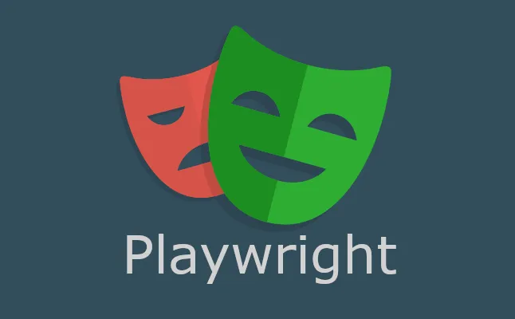

<p align="center">
  <a href="" rel="noopener">
 </a>
</p>

<h2 align="center">
  <strong>RAKSUL TECHNICAL TEST</strong>
</h2>
<h4 align="center" style="padding-bottom: 10px;">
  <strong>Built with Playwright</strong>
</h4>

---

## 📜 Table of Contents

- [Description](#description)
- [Prerequisites](#prerequisites)
- [Running the tests](#tests)
- [Built Using](#built_using)

## 📝 Description <a name = "description"></a>

This repository contains a suite of automated tests for a web application, built using Playwright.
Playwright is a Node.js library to automate Chromium, Firefox, and WebKit with a single API. The
tests cover various aspects of the web application, including form submission, navigation, and user
interaction

### Resource scaffolds out:

```
├── env
├── global-setup.ts
├── global-teardown.ts
├── package-lock.json
├── package.json
├── playwright.config.ts
├── src
│   ├── configs
│   │   ├── Env.ts
│   │   └── ReadEnv.ts
│   ├── data
│   │   ├── InvalidData.json
│   │   └── ValidData.json
│   ├── fixtures
│   │   ├── BasePage.ts
│   │   └── BaseTest.ts
│   ├── helpers
│   │   ├── libs
│   │   ├── strings
│   │   └── types
│   └── pages
│       ├── locators
│       └── page_objects
├── tests
│   └── test_raksul_form.spec.ts
└── tsconfig.json
```

## ⚠️ Prerequisites <a name = "prerequisites"></a>

1. Have NodeJS install on your machine (https://nodejs.org/en/download)
2. Have an IDE install on your machine (VS Code is recommended
   https://code.visualstudio.com/Download)

### Installation

1. Clone the source code the repo
   `git clone https://{your_token}@github.com/cody-htt/playwright-raksul-test.git`
2. Run `npm ci` to install all dependencies

## 🔧 Running the tests <a name = "tests"></a>

### Run test on local machine

1. Open your terminal.
2. Navigate to the project directory. If your project is in a directory called my-project, you would
   do this with the command: `cd path/to/my-project` (remember to teplace path/to/my-project with
   the actual path to your project.)
3. To run the tests in Chromium, use the command: `npm run test:local:chromium`
4. To run the tests in Firefox, use the command: `npm run test:local:firefox`

### Run test on Github Action

1. Go to my repository on Github (https://github.com/cody-htt/playwright-raksul-test)
2. Click on the "Actions" tab. Click on the "Actions" tab.
3. Click on the "Playwright Tests" workflows
4. Click on the "Run workflow" button
5. Enter the browser you want to execute the test on (chromium, firefox)
6. Click on the "Run workflow" green button
7. Wait for the workflow to complete

## ⛏️ Built Using <a name = "built_using"></a>

- [Playwright](https://playwright.dev/) - Node.js library to automate Chromium, Firefox and WebKit
- [TypeScript](https://www.typescriptlang.org/) - Static type checking for JavaScript
- [Node.js](https://nodejs.org/) - JavaScript runtime for server-side execution
- [GitHub Actions](https://github.com/features/actions) - CI/CD platform
